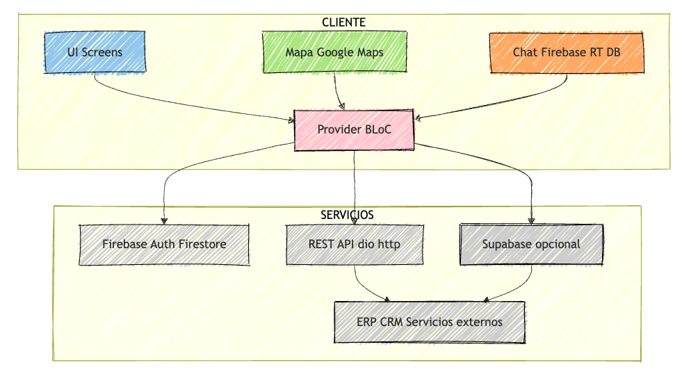

# 📱 Diseño de App con Flutter – Ideas y Recomendaciones

## 1. Objetivo de la app

Crear una app de actividades donde:

- Los usuarios puedan **crear actividades**.
- Cada actividad aparezca en un **mapa mundial** automáticamente.
- Los usuarios puedan **chatear entre sí**.
- Integración con **base de datos y sistemas externos** (ERP, APIs…).

---

## 2. Elección del motor de desarrollo

**Flutter** – recomendado por:

- Multiplataforma: iOS + Android
- UI flexible y moderna
- Comunidad grande y documentación extensa
- Posibilidad de conectar con bases de datos, APIs, chat, mapas…

### Alternativas según necesidad

| Necesidad | Herramienta |
|---|---|
| JavaScript / web + móvil | React Native |
| Juegos o gráficos 3D | Unity / Unreal Engine |
| Prototipos sin código | Adalo / AppGyver |

---

## 3. Base de datos y backend

Flutter no trae base de datos nativa, pero se integra con:

- **SQLite** → local
- **Firebase Firestore / Realtime Database** → nube, en tiempo real
- **Supabase / PostgreSQL / MySQL / ERP** → vía APIs REST o GraphQL

Se pueden almacenar:

- Datos de usuarios
- Actividades (nombre, descripción, fecha, ubicación)
- Mensajes de chat
- Preferencias y estadísticas

---

## 4. Chat entre usuarios

### Opción 1 – Firebase (Firestore o Realtime Database)

- Fácil y rápido de implementar
- Mensajes en tiempo real
- Autenticación integrada (`Firebase Auth`)
- Notificaciones push incluidas

### Opción 2 – Socket.IO / WebSockets

- Control total del backend
- Escalable y flexible
- Requiere servidor propio y manejo de base de datos

### Opción 3 – BaaS Open Source

- **Supabase**: SQL + Realtime
- **Appwrite**: backend completo + chat en tiempo real

> **Recomendación inicial:** Firebase si quieres rapidez; Socket.IO si buscas escalabilidad y control.

---

## 5. Mapa mundial con registros automáticos

### Funcionalidad

Cuando un usuario crea una actividad:

1. Selecciona ubicación → se guardan latitud y longitud.
2. La app crea un marcador automáticamente en esa posición.
3. Se pueden usar iconos personalizados según tipo de actividad.
4. Otros usuarios ven el marcador en tiempo real si usas Firestore o WebSockets.

### Paquetes Flutter recomendados

- `google_maps_flutter` → Google Maps nativo
- `flutter_map` → OpenStreetMap

### Flujo de ejemplo

1. Usuario crea actividad (formulario)
2. App obtiene ubicación (ciudad o GPS)
3. Guarda actividad con coordenadas en base de datos
4. Mapa lee base de datos → añade marcador automáticamente
5. Otros usuarios ven el marcador actualizado en tiempo real

---

## 6. Conexión con sistemas externos

Cualquier sistema con API REST / GraphQL se puede integrar:

- ERP
- CRM
- Servicios de pago
- Sistemas internos de empresa

Flutter se comunica mediante:

- Paquetes `http` o `dio`
- JSON / XML para enviar y recibir datos

---

## 7. Gestión de transporte y tiempo *(bonus para prácticas)*

Si la app incluyera geolocalización o transporte:

- Se pueden calcular rutas y tiempos usando **Google Maps APIs**
- Permite mostrar distancia y tiempo a cada actividad

---

## 8. Buenas prácticas

- **Prototipado primero**: wireframes en Figma antes de codificar
- **Empieza pequeño**: chat básico + creación de actividad → luego mapa + filtros + iconos
- **Uso de paquetes Flutter confiables**: `firebase_core`, `google_maps_flutter`, `cloud_firestore`
- **Seguridad y autenticación**: siempre manejar usuarios y datos sensibles con Firebase Auth u otro sistema seguro
- **Pruebas constantes**: Flutter permite Hot Reload → testea cambios rápidamente

---

## 9. Resumen del stack recomendado

| Componente | Recomendación |
|---|---|
| Multiplataforma | Flutter |
| Base de datos | Firebase Firestore o Supabase |
| Chat | Firebase Realtime o Socket.IO |
| Mapas | `google_maps_flutter` / `flutter_map` |
| Backend externo | APIs REST / GraphQL |

### Utilidades

| Componente | Recomendación | Detalles |
|---|---|---|
| UI / Screens | Flutter Widgets | Pantallas de login, lista de lobbys, chat, mapa, formulario de actividad |
| Gestión de estado	| Provider / Riverpod / BLoC | Para sincronizar datos entre pantallas (usuarios, lobbys, chat) |
| Base de datos | Firebase Firestore o Supabase	| Firestore permite datos en tiempo real y es fácil de sincronizar con chat y mapas |
| Autenticación | Firebase Auth	| Email, Google, Apple, etc. |
| Chat en tiempo real | Firestore Realtime Database o WebSockets | Cada lobby crea automáticamente su propio chat |
| Mapas | google_maps_flutter o flutter_map	| Muestra actividades en el mapa con marcadores dinámicos |
| Notificaciones | firebase_messaging | Notifica a integrantes sobre cambios en lobbys o mensajes nuevos |
| Pagos / Costes | Stripe / PayPal API | Para distribuir gastos entre participantes, calcular total por persona |

---

## 10. Estructura directorio

``` txt
lib/
├─ main.dart               # Entrada principal
├─ models/
│   ├─ user.dart
│   ├─ lobby.dart
│   ├─ message.dart
├─ providers/              # Gestión de estado
│   ├─ auth_provider.dart
│   ├─ lobby_provider.dart
│   ├─ chat_provider.dart
├─ screens/
│   ├─ login_screen.dart
│   ├─ lobby_list_screen.dart
│   ├─ lobby_detail_screen.dart
│   ├─ chat_screen.dart
│   ├─ map_screen.dart
│   ├─ search_screen.dart
├─ services/
│   ├─ firestore_service.dart
│   ├─ payment_service.dart
│   ├─ map_service.dart
```

---

## 11. Arquitectura recomendada para el TFG

